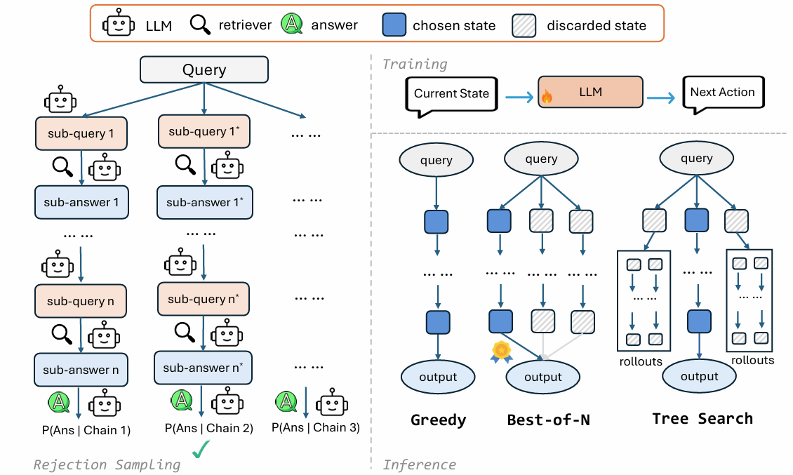

# CoRAG (Chain-of-Retrieval Augmented Generation)

The training data, model, and evaluation code for the paper [Chain-of-Retrieval Augmented Generation](https://arxiv.org/abs/2501.14342).



## Available Data

| Dataset                     | Short description                           |
|-----------------------------|---------------------------------------------|
| [corag/multihopqa](https://huggingface.co/datasets/corag/multihopqa) | MultihopQA datasets and model predictions   |
| [corag/kilt](https://huggingface.co/datasets/corag/kilt) | KILT benchmark with top-k retrieval results |
| [corag/kilt-corpus](https://huggingface.co/datasets/corag/kilt-corpus) | KILT-version of Wikipedia for retrieval     |
| [corag/kilt-corpus-embeddings](https://huggingface.co/datasets/corag/kilt-corpus-embeddings) | Corpus embeddings from `e5-large-v2`  |

## Available Model

| Model                       | Short description                   |
|-----------------------------|-------------------------------------|
| [corag/CoRAG-Llama3.1-8B-MultihopQA](https://huggingface.co/corag/CoRAG-Llama3.1-8B-MultihopQA) | CoRAG-8B fine-tuned for multihop QA |

## Requirements

```bash
pip install -r requirements.txt
```

## How to Run

Here we provide an example for running inference with CoRAG-8B on the MultihopQA dataset.
We tested this on a machine with 8 A100 GPUs (40GB).

Everything below assumes you are in the `corag` directory.

1. Download embeddings.

```bash
bash scripts/download_embeddings.sh
```

2. Start the E5 and vLLM servers and load the CoRAG-8B model.

```bash
# The server logs will be in vllm_server.log
source ./scripts/start_e5_vllm_servers.sh
```

3. Run the inference script. By default, we will use greedy decoding with max path length `L = 6`.

```bash
# It will evaluate on [2wikimultihopqa, bamboogle, hotpotqa, musique] sequentially.
bash scripts/eval_multihopqa.sh
```

At the end, you will see the evaluation metrics similar to the following (for MuSiQue dataset):

```json
{
    "em": 27.679,
    "f1": 38.532,
    "accuracy": 27.141,
    "num_samples": 2417,
    "max_path_length": 6,
    "decode_strategy": "greedy",
    "token_consumed": 23818600,
    "average_token_consumed_per_sample": 9854.613156805957
}
```

Due to the randomness of the sampling process, the results may vary slightly each time you run the script especially for small datasets like Bamboogle.

## Citation

If you find this repository useful, please consider citing our paper:

```bibtex
@article{wang2025chain,
  title={Chain-of-Retrieval Augmented Generation},
  author={Wang, Liang and Chen, Haonan and Yang, Nan and Huang, Xiaolong and Dou, Zhicheng and Wei, Furu},
  journal={arXiv preprint arXiv:2501.14342},
  year={2025}
}
```
